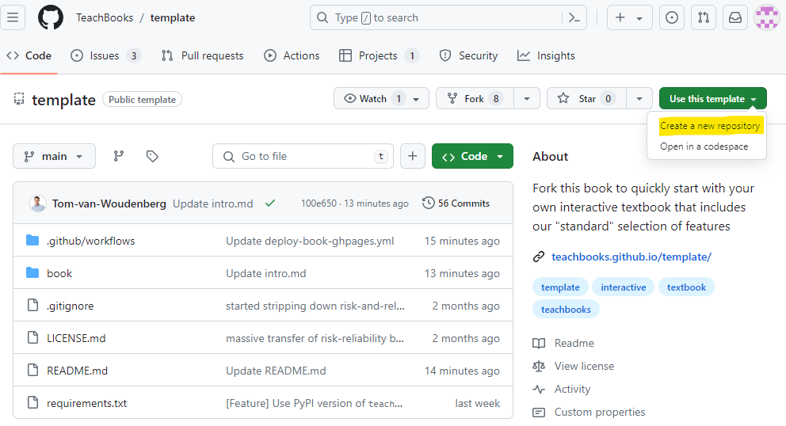
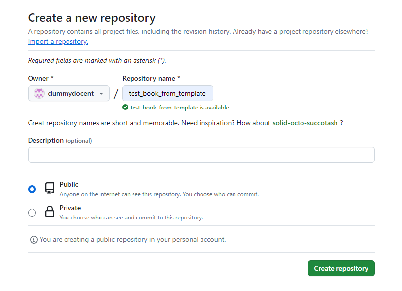
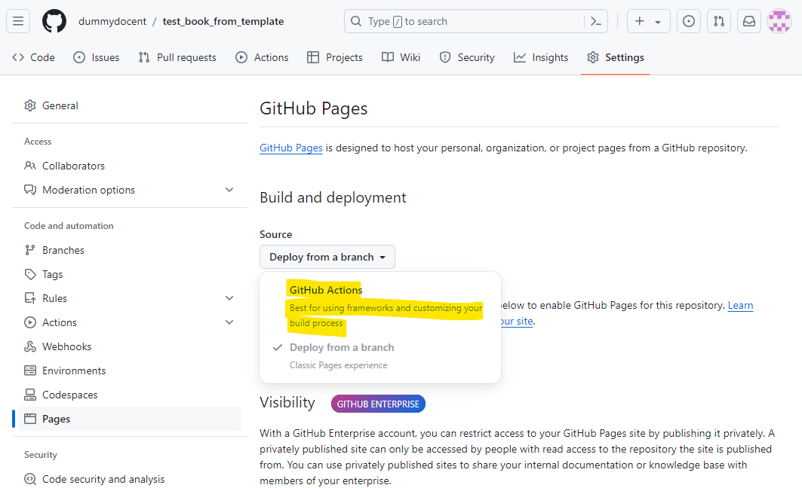
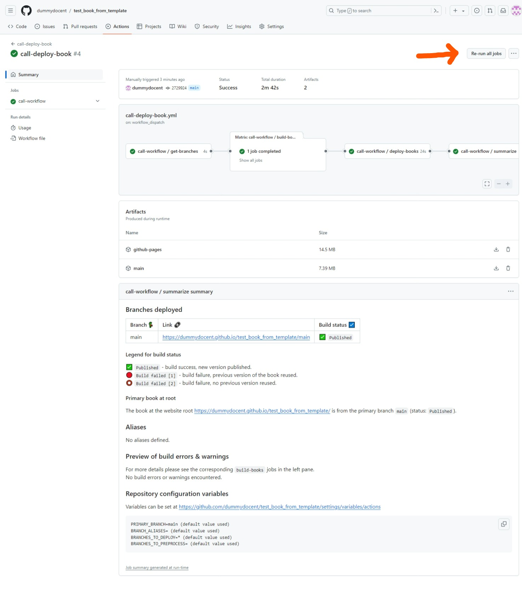
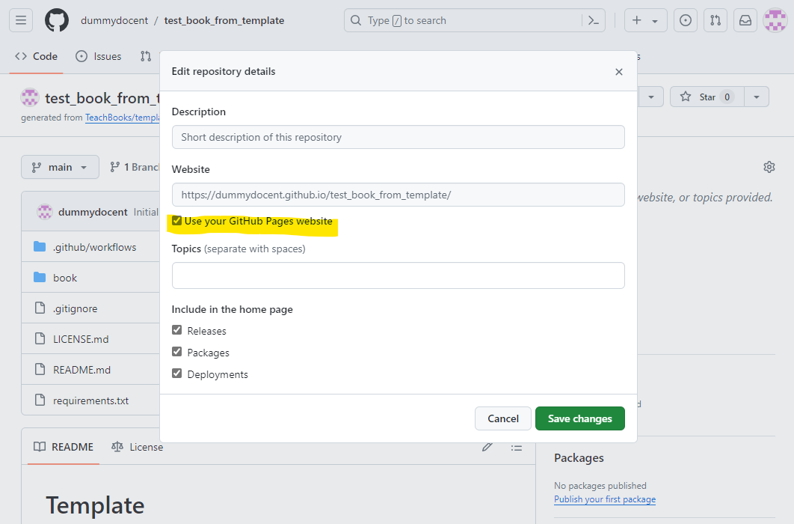

# Your first TeachBook using the GitHub template

The template allows you to start your own TeachBook and hosting that TeachBook online without knowledge on Git, the Jupyter book package, python or anaconda. It doesn't elaborate on the collaborative functionalities of Git or how to edit the book. Please look at our manual (https://teachbooks.io/manual) to find more about that!

## How to get started

How to use the template is demonstrated in the figure below, all steps are elaborated on in the following step-by-step tutorial.

Video available [here](https://youtu.be/nN3Oi_MVvF0)

1. To get started making your TeachBook with our functionalities, use the [template TeachBook](https://github.com/TeachBooks/template) as template:

2. Fill in a repository name, this name will be used in the future url of your book:

3. You can choose for `Private` only if you've GitHub Pro, GitHub Team, GitHub Enterprise Cloud, or GitHub Enterprise Server. Otherwise, you won't be able to publish your TeachBook online.

4. (Only required for private repositories:) Create a Personal Access Token (classic) with at least the scopes `repo`, `read:org` and `gist` as described in the [github documentation](https://docs.github.com/en/authentication/keeping-your-account-and-data-secure/managing-your-personal-access-tokens), and add this token with the name `GH_PAT` as a `Repository secret` or `Organization secret` (`Settings` > `Secrets and variables` > `Actions` > `Repository secrets` or `Organization secrets`).

5. You need to activate GitHub pages so that your website is published to the internet. As long as you don't do this your TeachBook is not published online. Actually, now that you've taken this template our workflow tries to publish it to GitHub pages, which you didn't have the chance to activate yet. That's why you probably received an email with 'call-deploy-book: Some jobs were not successful' and you see the failed job under `Initial commit`. You can activate GitHub pages by setting the source for GitHub pages to GitHub Actions under `Settings` - `Pages` - `Build and deployment` - `Source` - `GitHub Actions`:

6. Make an edit to the TeachBook by editing and committing changes to one of the files in the `book/` subdirectory (available under `Code`).  Now checkout the progress of the publishing workflow under `Actions` - `All workflows` -  `call-deploy-book` -`<the most recent workflow run>`. Remember, the first commit which is there has failed because GitHub Pages wasn't activated at the time of `Initial commit`, you could also re-run that job if you don't want to make an edit. You can do so by running the workflow from `Actions` - `All workflows` - `call-deploy-book` - `Initial commit` - `Re-run all jobs` - `Re-run jobs`:

7. When the workflow has finished, visit your build TeachBook at `https://<username or organiszation_name>.github.io/<repository_name>` (case sensitive). For our example it is [https://dummydocent.github.io/test_book_from_template/](https://dummydocent.github.io/test_book_from_template/) for the shown repository. These links are visible in the action's summary as well, as shown in the figure of step 4.

Additional tip: 
Set the repository website as your GitHub Pages website under `Code`- `About` - `Settings icon` - `Website` - `Use your GitHub Pages Website`

## Features
- A github repository structure for making a [Jupyter Book](https://github.com/executablebooks/jupyter-book) (`/book`)
- An empty TeachBook containing an intro page on root, an example markdown page, an example jupyter notebook page, an example references page. and an example credits page. (`/book/_toc.yml`, `/book/_config.yml`, `/book/credits.md`, `/book/intro.md`, `/book/references.md`, `/book/some_content/overview.md`, `/book/some_content/text_and_code.ipynb`)
- A file ready for adding references (`references.bib`, `/book/references.md`)
- An example favicon (web browser icon) (`/book/figures/favicon.ico`, `book/_config.yml`.)
- An example logo (`/book/figures/TUDelft_logo_rgb.png`, `/book/config.yml`)
- The configuration files set ready to make your Jupyter Notebooks pages work with [live code using our sphinx-thebe extension](https://teachbooks.io/manual/features/live_code.html) and our recommended settings (`/book/config.yml`)
- An example of setting up preprocessing your table of contents to hide certain draft chapters for eg. students (`_toc.yml`)
- A file containing all the recommended software packages (`requirements.txt`)
- A file containing the recommended license CC BY 4.0 (`LICENSE.md`)
- Our [GitHub workflow for publishing your TeachBook to GitHub Pages](https://github.com/TeachBooks/deploy-book-workflow) (`.github/workflow/call-deploy-book.yml`)
- A gitignore file containing standard python filetype to ignore (`.gitignore`)
- A readme containing information how to use the template, which can adjusted after using the template (`README.md`)

## Contribute
This tool's repository is stored on [GitHub](https://github.com/TeachBooks/template). The `README.md` of the branch `manual_description` is also part of the [TeachBooks manual](https://teachbooks.io/manual/external/template/README.html) as a submodule. If you'd like to contribute, you can create a fork and open a pull request on the [GitHub repository](https://github.com/TeachBooks/template). To update the `README.md` shown in the TeachBooks manual, create a fork and open a merge request for the [GitHub repository of the manual](https://github.com/TeachBooks/manual). If you intent to clone the manual including its submodules, clone using: `git clone --recurse-submodulesgit@github.com:TeachBooks/manual.git`.
